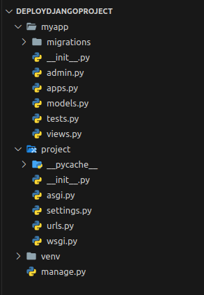

# Deploy Django project with Docker, Nginx and Gunicorn

## Why are we going to do this?

- When the process of a Django project is finished, in order to publish this project, we must load it on a host or VPS (virtual private server).

## Why do we use Nginx and Gunicorn?

- Django not serving your static files in debug False. you need to serve it with web server like nginx, apache or etc.
- debug False used in production environment. in production environment you used another tools to run django.

## What is Nginx?

- Nginx is a web server that can also be used as a reverse proxy, load balancer, mail proxy, and HTTP cache.
- Static files ->Files that are not affected by the server code. For example, CSS and Image files used in a landing page.
- Media files -> Files uploaded by users.

---

# let's start

## Setup Django

### 1. Install Django and create an app

- create virtual environment
```markdown
python3 -m venv venv
```

- activation virtual environment (The following command is for activation in ubuntu.)
```markdown
source venv/bin/activate
```

- install django
```markdown
pip install django
```

- install gunicorn - python WSGI HTTP server
```markdown
pip install gunicorn
```

- create project
```markdown
django-admin startproject project .
```

- create app
```markdown
python manage.py startapp myapp
```


### The structure of the project so far is as follows :



### 2. add app to INSTALLED_APPS and Setup up settings for static and media files

```markdown
# settings.py

#add myapp to INSTALLED_APPS
INSTALLED_APPS = [
  ..., # default apps
  "myapp",
  ]
```

```markdown
STATIC_URL = "static/"   # e.g. localhost:80/static/styles.css
MEDIA_URL = "media/"     # e.g. localhost:80/media/image.jpg

# directory where all static files of the app are going to be put
STATIC_ROOT = "/vol/static"

# directory where all files uploaded by users(media files) are going to be put
MEDIA_ROOT = "/vol/media"
```

### 3. Inside myapp/models.py create a model

- The purpose of this model is to test if NGINX will serve media files.

```markdown
# myapp/models.py

from django.db import models

class FootballPlayer(models.Model):
    name = models.CharField(max_length=200)
    img = models.ImageField()
```

## Setup Docker and docker-compose

### 1. Create a Dockerfile for the Django application

```markdown
FROM python:3.11.5-slim-bullseye

ENV PYTHONUNBUFFERED 1
ENV PYTHONDONTWRITEBYTECODE 1

WORKDIR /app

COPY . /app/
COPY ./requirements.txt /app/

RUN pip install --upgrade pip
RUN pip install -r requirements.txt

ENTRYPOINT [ "sh", "-c", "./scripts/start.sh" ]
```

### 2. Create a scripts directory in the project root directory. Inside it, create a start.sh file.
///

- This bash script will run once we spin up a Django container.
```markdown
#!/bin/sh

python manage.py makemigrations
python manage.py migrate

# collects all static files in our app and puts it in the STATIC_ROOT
python manage.py collectstatic --noinput

gunicorn project.wsgi -b 0.0.0.0:8000
```

### 3. Create a proxy directory in the project's root directory.
///

---

## Setup NGINX

### a) Create default.conf.tpl

- In Nginx, we use server block to set up configuration for virtual server.
- For this case, we have one server block listening for connections in port 80.
- Requests with the prefix /static will be directed to /vol/static, where we will put all our static files.
- Requests with the prefix /media will be directed to /vol/media, where we will put all our media files.
- Any other request without prefix /static or /media will be forwarded to http://app:8000, where our web application runs.

```markdown
# proxy/default.conf.tpl

server {
    listen ${LISTEN_PORT};

    location /static {
        alias /vol/static;
    }

    location /media {
        alias /vol/media;
    }

    location / {
        proxy_pass      http://${APP_HOST}:${APP_PORT};
        include         /etc/nginx/proxy_params;
    }
}
```

### b) Create proxy params

- These parameters are used to forward information to the application you’re proxying to. For example, here request headers such as Host are forwarded to the server we are proxying to.

```markdown
# proxy/proxy_params

proxy_set_header Host $http_host;
proxy_set_header X-Real-IP $remote_addr;
proxy_set_header X-Forwarded-For $proxy_add_x_forwarded_for;
proxy_set_header X-Forwarded-Proto $scheme;
```

### c) Create a Dockerfile
```markdown
# proxy/Dockerfile

FROM nginx

ENV APP_HOST=app
ENV APP_PORT=8000
ENV LISTEN_PORT=80

COPY ./start.sh /start.sh
RUN chmod +x /start.sh

RUN touch /etc/nginx/conf.d/default.conf

COPY ./proxy_params /etc/nginx/
COPY ./default.conf.tpl /etc/nginx/

ENTRYPOINT [ "sh", "-c", "/start.sh" ]
```

### d) Create start.sh script

- This bash script is executed when we spin a container.
- envsubst command substitutes all environment variables in /etc/nginx/default.conf.tpl with their values then the output is redirected to /etc/nginx/conf.d/default.conf

```markdown
#!/bin/sh

set -e

envsubst < /etc/nginx/default.conf.tpl > /etc/nginx/conf.d/default.conf

# start nginx with the dameon running in the foreground
nginx -g "daemon off;"
```

### 4. Create a docker-compose.yml file in the project’s root directory.

- This file will start two services i.e. app and proxy, each running in a docker container.
- The two services can communicate using their service name since they are connected to the same docker network. For example, when we want to forward an HTTP request from the proxy service to the app service, we will use http://app:8000
- Docker volumes are used to persist data generated and used by Docker containers.
- In this case, we will map all the static files and media files generated by our application to a docker volume then all those static and media files will be mapped from the docker volume to a path in the nginx container.
- For static files, we map them to /vol/static/ path of the nginx server.
- For media files, we map them to /vol/media/ path of the nginx server.

```markdown
# docker-compose.yml

version: "3.8"

services:
  app:
    build:
      context: .
    restart: always
    volumes:
      - static-data:/vol/static
      - media-data:/vol/media

  proxy:
    build:
      context: ./proxy
    restart: always
    volumes:
      - static-data:/vol/static
      - media-data:/vol/media
    ports:
      - 80:80
    depends_on:
      - app

volumes:
  static-data:
  media-data:
```

### 5. Create requirements.txt file.

```markdown
pip freeze > requirements.txt
```

- Because we intend to receive an image file. Add the pillow library to the requirements.txt file.
///

- Finally, the structure of your project should be as follows :
///

- We use the following command to give access to the start.sh file :
```markdown
chmod +x scripts/start.sh
```

## Note: If we do not execute the above command, we will encounter this scene.
///

- build Docker :
```markdown
docker-compose build --no-cache
```

- and finally :
```markdown
docker-compose up
```

- Finally, the server should be running for you.
///

- Visit http://localhost/ to check if the static files are served.
///


- To ensure the correct operation of media files, we create a superuser and upload a photo through the admin panel.


### 1. We right-click on the main program and go to the Attach Shell section :
///

### 2. We create a superuser using the following command.
```markdown
python manage.py createsuperuser
```

///

### 3. Go to http://localhost/admin address and enter the admin panel.
///

### 4. If we click on the photo link, it should show the photo.
///

## It works properly :'))
